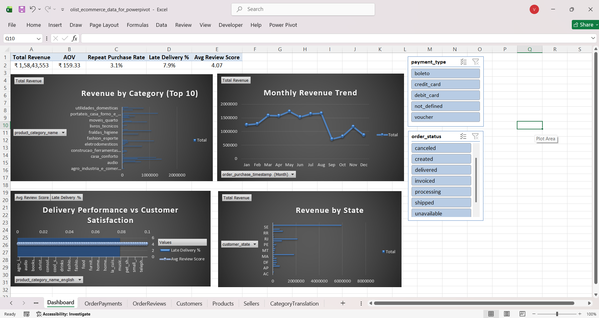

# E-Commerce KPI Dashboard - Power Pivot & DAX

A relational data model and interactive KPI dashboard built in Microsoft Excel (Power Pivot + DAX) using the Olist Brazilian E-Commerce dataset. This project demonstrates end-to-end BI work: data modeling, DAX measure authoring, and dashboard design - without flattening everything into a single sheet.

---

## Dashboard Preview



---

## Project Overview

Most beginner data projects load everything into one flat table. This project takes the opposite approach - 8 normalized tables loaded into Power Pivot, connected via defined relationships, with business KPIs calculated as proper DAX measures on top of the model.

**Key business questions answered:**
- What is the total revenue and average order value?
- How many customers actually come back for a second purchase?
- Which product categories have the highest late delivery rates?
- Does late delivery correlate with lower customer review scores?
- Which Brazilian states drive the most revenue?

---

## Tools & Technologies

- Microsoft Excel (Professional Plus 2021)
- Power Pivot (Data Model)
- DAX (Data Analysis Expressions)
- PivotCharts & Slicers

---

## Dataset

**Olist Brazilian E-Commerce Public Dataset**  
Source: [Kaggle](https://www.kaggle.com/datasets/olistbr/brazilian-ecommerce)  
99,441 orders placed between 2016–2018 across multiple Brazilian marketplaces.

### Tables Used

| Table | Grain | Key Columns |
|---|---|---|
| tblOrders | One order | order_id, customer_id, status, timestamps |
| tblOrderItems | One line item | order_id, product_id, price, freight_value |
| tblCustomers | One customer record | customer_id, customer_unique_id, state |
| tblProducts | One product | product_id, category_name |
| tblOrderReviews | One review | order_id, review_score |
| tblOrderPayments | One payment installment | order_id, payment_type, value |
| tblSellers | One seller | seller_id, state |
| tblCategoryTranslation | One category | category_name → category_name_english |

---

## Data Model

8 tables connected via 6 relationships in Power Pivot Diagram View:

- `tblOrderItems[order_id]` → `tblOrders[order_id]`
- `tblOrders[customer_id]` → `tblCustomers[customer_id]`
- `tblOrderItems[product_id]` → `tblProducts[product_id]`
- `tblOrderItems[seller_id]` → `tblSellers[seller_id]`
- `tblOrderReviews[order_id]` → `tblOrders[order_id]`
- `tblProducts[product_category_name]` → `tblCategoryTranslation[product_category_name]`

> **Note:** `tblOrderPayments` is deliberately not connected via a relationship. An order can have multiple payment rows (split across installments or payment methods), so revenue aggregation uses SUMX/DISTINCTCOUNT rather than relying on a join that would double-count.

---

## DAX Measures

### Total Revenue
```
Total Revenue := SUMX(tblOrderItems, tblOrderItems[price] + tblOrderItems[freight_value])
```
SUMX iterates row by row and evaluates price + freight per line item before aggregating - necessary because the combined value doesn't exist as a single column.

---

### Average Order Value (AOV)
```
AOV := DIVIDE([Total Revenue], DISTINCTCOUNT(tblOrders[order_id]))
```
DIVIDE handles divide-by-zero gracefully. DISTINCTCOUNT on order_id rather than COUNTROWS on OrderItems - because one order can have multiple line items.

---

### Repeat Purchase Rate
```
Customers with 2+ Orders :=
CALCULATE(
    DISTINCTCOUNT(tblCustomers[customer_unique_id]),
    FILTER(
        VALUES(tblCustomers[customer_unique_id]),
        CALCULATE(DISTINCTCOUNT(tblOrders[order_id])) > 1
    )
)

Repeat Purchase Rate := DIVIDE([Customers with 2+ Orders], DISTINCTCOUNT(tblCustomers[customer_unique_id]))
```
Uses `customer_unique_id` - not `customer_id`. A critical data quality distinction: `customer_id` is unique per order, while `customer_unique_id` is unique per person. Using `customer_id` here would silently overstate the repeat rate. The inner CALCULATE performs context transition, re-evaluating order count within each customer's own filter context.

---

### Late Delivery Rate
```
Late Deliveries :=
CALCULATE(
    COUNTROWS(tblOrders),
    FILTER(
        tblOrders,
        tblOrders[order_delivered_customer_date] > tblOrders[order_estimated_delivery_date]
    )
)

Late Delivery % := DIVIDE([Late Deliveries], DISTINCTCOUNT(tblOrders[order_id]))
```
FILTER with a row-context boolean comparison - necessary because CALCULATE's simpler column-filter syntax can't express a comparison between two columns on the same row. Undelivered/cancelled orders are implicitly excluded since blank date comparisons return FALSE.

---

### Average Review Score
```
Avg Review Score := AVERAGEX(tblOrderReviews, tblOrderReviews[review_score])
```
Intentionally simple - included as the counter-example to over-engineering. Knowing when NOT to reach for CALCULATE is as much a signal of DAX fluency as knowing when to use it.

---

## Dashboard

**KPI Summary Table:** Total Revenue · AOV · Repeat Purchase Rate · Late Delivery % · Avg Review Score

**Charts:**
1. Revenue by Category (Top 10) - horizontal bar
2. Monthly Revenue Trend - line chart
3. Delivery Performance vs Customer Satisfaction - combo chart (bar + line by category)
4. Revenue by State - horizontal bar

**Slicers:** order_status · payment_type (connected to all visuals)

---

## Key Findings

- **R$15.8M total revenue** across 99,441 orders
- **R$159.33 AOV** - typical for a general marketplace
- **3.1% repeat purchase rate** - low, consistent with a marketplace model where buyers don't return to the same seller
- **7.9% late delivery rate** - worth cross-referencing with review scores by category
- **4.07/5 average review score** - relatively high despite the delivery issues

---

## Data Quality Note

`customer_id` in the Olist dataset is generated per order, not per customer. The actual person-level identifier is `customer_unique_id`. Using the wrong field for repeat purchase rate would have inflated the metric silently - caught during modeling, corrected before writing measures.

---

## Files

| File | Description |
|---|---|
| `dashboard_screenshot.png` | Dashboard preview |
